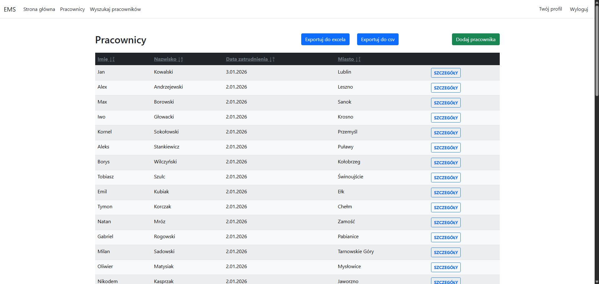

# 🏢 Employee Management System

A secure, multi-tenant employee management web application built with ASP.NET Core MVC, featuring row-level security and service layer architecture.


## 🎯 Overview

This application demonstrates a production-ready approach to employee data management with **user data isolation**. Each authenticated user can only access their own employee records, implemented through row-level security at both controller and service layers.

### Key Features

- ✅ **Full CRUD Operations** - Create, read, update, and delete employee records
- ✅ **Advanced Search** - Filter by name, surname, PESEL (Polish national ID), or city
- ✅ **Row-Level Security** - Complete data isolation between users
- ✅ **Comprehensive Validation** - Server-side and client-side validation for all fields
- ✅ **ASP.NET Core Identity** - Industry-standard authentication
- ✅ **Responsive UI** - Bootstrap 5 mobile-first design
- ✅ **Polish Localization** - Custom validation messages and UI text
- ✅ **Export to CSV/Excel** - Allows users to export data to CSV or Excel files.

## 🛠️ Tech Stack

**Backend:**
- .NET 8
- ASP.NET Core MVC
- Entity Framework Core
- ASP.NET Core Identity
- SQL Server
- EPPlus

**Frontend:**
- Razor Views
- Bootstrap 5
- jQuery Validation

## 🏗️ Architecture

```
┌─────────────┐
│ Controllers │ ← [Authorize] + GetUserId()
└──────┬──────┘
       │
       ▼
┌─────────────┐
│  Services   │ ← IEmployeeService (filters by userId)
└──────┬──────┘
       │
       ▼
┌─────────────┐
│  DbContext  │ ← Entity Framework Core
└──────┬──────┘
       │
       ▼
┌─────────────┐
│ SQL Server  │
└─────────────┘
```

**Design Patterns:**
- Service Layer Pattern
- Dependency Injection
- Repository-like abstraction
- Defense in Depth (security at multiple layers)

## 🔒 Security Features

### Multi-Tenant Data Isolation

Every database query is automatically filtered by the authenticated user's ID:

```csharp
// Service layer ensures data isolation
public async Task<List<Employee>> GetEmployeesAsync(string userId)
{
    return await _context.Employees
        .Where(e => e.UserId == userId)
        .Include(e => e.Address)
        .ToListAsync();
}
```

### Defense in Depth

Security checks occur at multiple layers:

1. **Controller Level:** `[Authorize]` attribute + `GetUserId()` verification
2. **Service Level:** All methods require `userId` parameter
3. **Database Level:** Foreign key to `AspNetUsers` table

This prevents unauthorized data access even if authorization attributes are misconfigured.

## 📋 Employee Data Model

Each employee record includes:

**Personal Information:**
- First Name, Last Name
- PESEL (Polish national ID - validated format), unique
- Email, Phone

**Employment Details:**
- Position
- Salary (decimal with 2 precision)
- Hire Date

**Address:**
- City, Street Name
- House Number, Apartment Number
- Postal Code

**Audit Trail:**
- Created At, Updated At
- User ID (owner)

## 🚀 Getting Started

### Prerequisites

- [.NET 8 SDK](https://dotnet.microsoft.com/download/dotnet/8.0)
- SQL Server (LocalDB, Express, or full version)
- Visual Studio 2022 or 2026 or VS Code

### Installation

1. **Clone the repository**
```bash
git clone https://github.com/LukaszMateuszSobczak/EmployeeManagmentApp.git
cd EmployeeAppIdentity
```

2. **Update the connection string**
   
   Edit `appsettings.json`:
```json
{
  "ConnectionStrings": {
    "DefaultConnection": "Server=(localdb)\\mssqllocaldb;Database=EmployeeAppDB;Trusted_Connection=True;"
  }
}
```

3. **Apply database migrations**
```bash
dotnet ef database update
```

4. **Run the application**
```bash
dotnet run
```

5. **Open in browser**

   Navigate to `https://localhost:5001` (or the URL shown in console)

6. **Register a new account**

   Click "Register" and create your account. Sample employee data will be seeded for your user.

## 📸 Screenshots

### Employee List

*Main view with search and CRUD actions*

### Advanced Search

*Filter employees by multiple criteria*

### Employee Form

*Comprehensive validation for all fields*

> **Note:** Add screenshots to the `docs/` folder to display them here

## 🧪 Validation Rules

- **PESEL:** Exactly 11 digits, must be unique among employees belonging to the same user
- **Email:** Valid email format
- **Phone:** Exactly 9 digits
- **Postal Code:** Polish format (XX-XXX)
- **Salary:** Decimal with custom client-side validation (accepts both comma and period)

### Custom jQuery Validation

```javascript
// Accept both comma and period as decimal separator
$.validator.methods.number = function (value, element) {
    if (this.optional(element)) return true;
    value = value.replace(",", ".");
    return !isNaN(value) && !isNaN(parseFloat(value));
};
```

## 📂 Project Structure

```
EmployeeAppIdentity/
├── Controllers/
│   └── EmployeeController.cs      # MVC controller with authorization
├── Services/
│   ├── IEmployeeService.cs        # Service interface
│   └── EmployeeService.cs         # Business logic + data access
├── Models/
│   ├── Employee.cs                # Employee entity
│   └── Address.cs                 # Address entity (1-to-1)
├── Data/
│   ├── ApplicationDbContext.cs    # EF Core context
│   └── Migrations/                # Database migrations
├── Views/
│   └── Employee/                  # Razor views (Index, Create, Edit, etc.)
└── Areas/Identity/                # ASP.NET Core Identity scaffolded pages
```

## 🎓 Learning Objectives

This project demonstrates:

1. **Separation of Concerns** - Controllers delegate to services
2. **Security-First Design** - Row-level security implementation
3. **Entity Framework Core** - Migrations, relationships, querying
4. **ASP.NET Core Identity** - Authentication integration
5. **Data Validation** - Both server-side and client-side
6. **Responsive Design** - Mobile-friendly Bootstrap UI

## 🔮 Future Enhancements

- [ ] Pagination for large datasets
- [ ] Export to CSV/Excel
- [ ] Employee photo upload
- [ ] Soft delete functionality
- [ ] Advanced reporting (salary statistics, etc.)
- [ ] Role-based authorization (Admin, Manager, Viewer)
- [ ] Unit and integration tests

## 📝 License

This project is open source and available for educational purposes.

## 👤 Author

**Łukasz Mateusz Sobczak**

- GitHub: [@LukaszMateuszSobczak](https://github.com/LukaszMateuszSobczak)

---

⭐ If you find this project helpful, please consider giving it a star!
